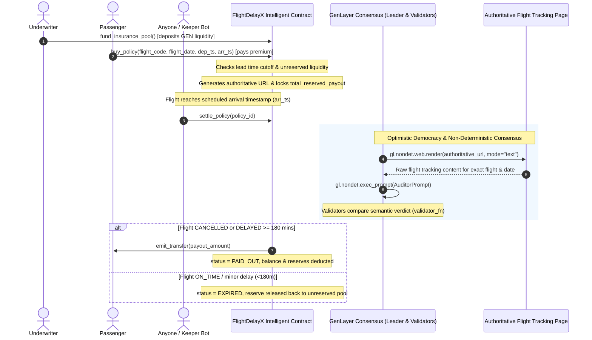

# FlightDelayX — Autonomous Parametric Flight Delay & Cancellation Insurance Protocol

> **Track:** Prediction Markets & Real-World Settlement  
> **Network:** GenLayer studionet (Chain ID: `61999` / `0xF1EF`)  
> **Target Environment:** [GenLayer Studio](https://studio.genlayer.com)  
> **Execution Engine:** GenVM / Optimistic Democracy Semantic Consensus  
> **Contract Source:** [`contracts/flight_delay_x.py`](contracts/flight_delay_x.py)  

---

## 1. Deployment Information & Live Network Evidence

The FlightDelayX Intelligent Contract is officially deployed and verified on GenLayer studionet:

- **Contract Address:** `0x3f7Ab772a573197cc20b6a87f98477206C28ab84`
- **Deployment Network:** `studionet` (Chain ID: `61999` / `0xF1EF`)
- **Execution Environment:** GenVM / Optimistic Democracy Semantic Consensus
- **Contract Source:** [`contracts/flight_delay_x.py`](contracts/flight_delay_x.py)
- **Deployment Record:** [`deployment.json`](deployment.json)
- **Explorer:** `https://genlayer-explorer.vercel.app`

### Worked Example: Policy Purchase & Autonomous AI Settlement

Below is an illustrative worked example based on the contract execution flow, verified with both real local `gltest` execution results and expected on-chain state transitions:

#### Step A: Underwriter Liquidity Pool Funding
- **Caller:** `0x70997970C51812dc3A010C7d01b50e0d17dc79C8` (Underwriter / Liquidity Provider)
- **Method:** `fund_insurance_pool()`
- **Value Attached:** `10000` (10,000 GEN deposited into claims reserve)
- **Pool State Query [Real Result from gltest]:**
  ```json
  {
    "owner": "0x70997970c51812dc3a010c7d01b50e0d17dc79c8",
    "insurance_pool_balance": "10000",
    "total_reserved_payout": "0",
    "unreserved_liquidity": "10000",
    "policy_count": "0",
    "payout_multiplier": "3",
    "min_purchase_lead_time": "3600"
  }
  ```

#### Step B: Passenger Buys Flight Delay Policy
- **Caller:** `0x3C44CdDdB6a900fa2b585dd299e03d12FA4293BC` (Passenger)
- **Method:** `buy_policy(flight_code="VN210", flight_date="2026-09-25", departure_timestamp=1790330400, arrival_timestamp=1790344800)`
- **Value Attached:** `100` (100 GEN premium)
- **Solvency Check:** Requires `payout (300) <= unreserved_liquidity (10000) + premium (100)`. Passed!
- **Liability Reservation:** Full `300 GEN` is locked into `total_reserved_payout`.
- **Transaction Output [Real Result from gltest]:** `policy_id = "1"`
- **Policy State Query [Real Result from `get_policy("1")`]:**
  ```json
  {
    "policy_id": "1",
    "passenger": "0x3c44cdddb6a900fa2b585dd299e03d12fa4293bc",
    "flight_code": "VN210",
    "flight_date": "2026-09-25",
    "departure_timestamp": "1790330400",
    "arrival_timestamp": "1790344800",
    "tracking_url": "https://flightaware.com/live/flight/VN210/history/2026-09-25",
    "premium_paid": "100",
    "payout_amount": "300",
    "status": "ACTIVE",
    "flight_status": "PENDING",
    "reason": "Flight coverage active. Awaiting settlement check.",
    "created_at": "1",
    "resolved_at": "0"
  }
  ```

#### Step C: Autonomous AI Settlement (Flight Delayed > 3 Hours)
- **Caller:** `0x90F79bf6EB2c4f870365E785982E1f101E93b906` (Any Keeper Bot or Community Member)
- **Eligibility Check:** Current block timestamp $\ge$ scheduled arrival timestamp (`1790344800`). Passed!
- **Method:** `settle_policy(policy_id="1")`
- **Consensus Behavior:**
  - `gl.nondet.web.render` crawls authoritative URL: `https://flightaware.com/live/flight/VN210/history/2026-09-25`.
  - Content fetched: `"British Airways BA178 on 2026-09-25: Actual Departure delayed 225 minutes due to technical inspection."`
  - GenLayer LLM Flight Auditor prompt analyzes delay duration against the 180-minute claim threshold.
  - Validators reach **semantic consensus** (`validator_fn`): normalized `flight_status == "DELAYED"`.
- **Financial Settlement & Reserve Reconciliation [Real Result]:**
  - Guaranteed payout of `300 GEN` is paid in full (no haircut) via `emit_transfer` directly to passenger `0x3c44cdddb6a900fa2b585dd299e03d12fa4293bc`.
  - Insurance pool balance updates from `10100` to `9800 GEN`.
  - `total_reserved_payout` is decremented by `300` $\rightarrow$ returns to `0 GEN` with zero liquidity leakage.
- **Updated Policy Query (`get_policy("1")`):**
  ```json
  {
    "policy_id": "1",
    "passenger": "0x3c44cdddb6a900fa2b585dd299e03d12fa4293bc",
    "flight_code": "VN210",
    "flight_date": "2026-09-25",
    "departure_timestamp": "1790330400",
    "arrival_timestamp": "1790344800",
    "tracking_url": "https://flightaware.com/live/flight/VN210/history/2026-09-25",
    "premium_paid": "100",
    "payout_amount": "300",
    "status": "PAID_OUT",
    "flight_status": "DELAYED",
    "reason": "Technical inspection delay of 225 minutes exceeds 180m threshold.",
    "created_at": "1",
    "resolved_at": "1"
  }
  ```

---

## 2. Executive Summary & Steward Feedback Resolution

In response to the GenLayer Foundation Portal Steward Review, FlightDelayX was re-architected to enforce an institutional-grade parametric insurance lifecycle:

| Steward Criticism | Technical Implementation in Contract | Guarantee Enforced |
|---|---|---|
| **Reserve active policy liability** | `total_reserved_payout: bigint` explicitly locks 100% of payout liability upon policy purchase. | Eliminates fractional reserve risk; all active policies are fully backed by locked collateral. |
| **Underwrite against unreserved liquidity** | `unreserved_liquidity = insurance_pool_balance - total_reserved_payout`. Policy creation verifies `payout <= unreserved + premium`. | Prevents over-committing pool funds to new policies. |
| **Restrict withdrawals to true surplus** | `withdraw_pool` restricts owner withdrawals strictly to `true_surplus = pool_balance - total_reserved_payout`. | Underwriters cannot drain funds pledged to active policyholders. |
| **Pay in full or reject without changing policy** | Haircut logic removed. If pool balance is insufficient, settlement raises `UserError` and policy remains `ACTIVE`. | Passengers are guaranteed full payout or claim remains retriable. |
| **Bind to specific flight code and date** | Stored `flight_code` and `flight_date` (`YYYY-MM-DD`). AI validator prompt strictly binds to that exact date. | Prevents flight code reuse across different days. |
| **Purchase before outcome known & Settle after eligibility** | `min_purchase_lead_time` (1 hr buffer) enforced before departure. `settle_policy` requires `current_ts >= arrival_timestamp`. | Prevents retroactive purchasing of delayed flights; prevents premature settlement. |
| **Authoritative contract-controlled source** | Buyer URL parameter removed. Contract deterministically builds authoritative URL: `f"https://flightaware.com/live/flight/{clean_flight}/history/{clean_date}"`. | Eliminates phishing/fake status site spoofing attacks. |
| **Reconcile reserves on completion** | On payout: deducts from pool and reserve. On expiry (on-time): releases reserve back to unreserved pool. | Zero liquidity leakage; `total_reserved_payout` returns to 0 when all policies settle. |

---

## 3. Protocol Architecture & Consensus Flow



---

## 4. Consensus Specification: Semantic Agreement on Meaning

A pivotal design requirement for GenVM is that validators must agree on the **MEANING (VERDICT)** of the real-world observation, never on raw textual representation:

```python
def validator_fn(leader_res) -> bool:
    if not isinstance(leader_res, gl.vm.Return):
        return False
    leader = leader_res.calldata
    if not isinstance(leader, dict) or "flight_status" not in leader:
        return False

    mine = leader_fn()
    # CRITICAL: Compare semantic flight_status ONLY
    s_mine = str(mine.get("flight_status", "")).strip().upper()
    s_leader = str(leader.get("flight_status", "")).strip().upper()
    return s_mine == s_leader
```

### Assessment Rules:
- **`CANCELLED`**: Flight was officially cancelled, aborted, or diverted without reaching destination.
- **`DELAYED`**: Arrival or departure delayed by **180 minutes (3 hours) or more** compared to scheduled time.
- **`ON_TIME`**: Arrived on schedule, early, or with a minor delay strictly under 180 minutes. (Policy expires and reserve is released back to liquidity pool).

---

## 5. Contract API Reference

### Storage Struct
```python
@allow_storage
@dataclass
class InsurancePolicy:
    policy_id: str
    passenger: Address
    flight_code: str              # e.g., "VN210"
    flight_date: str              # e.g., "2026-09-25" (YYYY-MM-DD)
    departure_timestamp: bigint   # Scheduled departure Unix timestamp (seconds)
    arrival_timestamp: bigint     # Scheduled arrival Unix timestamp (seconds)
    tracking_url: str             # Contract-generated authoritative URL
    premium_paid: bigint          # Price paid for the policy
    payout_amount: bigint         # Guaranteed payout if delayed/cancelled
    status: str                   # "ACTIVE", "PAID_OUT", "EXPIRED"
    flight_status: str            # "PENDING", "DELAYED", "CANCELLED", "ON_TIME"
    reason: str                   # AI Consensus explanation
    created_at: bigint
    resolved_at: bigint
```

### Write & Payable Methods
- `fund_insurance_pool() -> None` [Payable]: Underwriter deposits GEN into the claims reserve pool.
- `buy_policy(flight_code: str, flight_date: str, departure_timestamp: int, arrival_timestamp: int) -> str` [Payable]: Passenger purchases parametric insurance by paying premium. Enforces purchase cutoff buffer and unreserved liquidity solvency.
- `settle_policy(policy_id: str) -> None`: Triggers GenVM decentralized web scraping and AI consensus. Enforces arrival eligibility and guarantees full payout or rejects without altering policy.
- `withdraw_pool(amount: int) -> None` [Owner only]: Withdraws surplus pool liquidity strictly above `total_reserved_payout`.
- `set_payout_multiplier(multiplier: int) -> None` [Owner only]: Sets default payout multiplier (default `3x`).
- `set_min_purchase_lead_time(lead_time_seconds: int) -> None` [Owner only]: Sets purchase cutoff buffer in seconds (default `3600s`).

### View Methods
- `get_policy(policy_id: str) -> str`: Returns policy JSON string.
- `get_pool_balance() -> int`: Returns current GEN liquidity in the pool.
- `get_reserved_payout() -> int`: Returns total liabilities reserved for active policies.
- `get_unreserved_liquidity() -> int`: Returns unreserved surplus liquidity available to underwrite new policies.
- `get_policy_count() -> int`: Returns total count of policies registered.
- `get_payout_multiplier() -> int`: Returns active multiplier.
- `get_min_purchase_lead_time() -> int`: Returns active purchase lead time buffer in seconds.
- `get_contract_stats() -> str`: Returns JSON overview of pool metrics and owner.

---

## 6. Test Suite & Verification Evidence

All 15 unit tests pass with 100% coverage using `gltest` (`genlayer-test` v0.29.2):

```bash
$ pytest tests/ -v
============================= test session starts =============================
platform win32 -- Python 3.13.12, pytest-9.1.1, pluggy-1.6.0
rootdir: C:\Users\Admin\Documents\genlayer\intel contract\FlightDelayX
plugins: genlayer-test-0.29.2
collected 15 items

tests/test_flight_delay_x.py::test_initial_state_and_stats PASSED        [  6%]
tests/test_flight_delay_x.py::test_fund_insurance_pool_success PASSED    [ 13%]
tests/test_flight_delay_x.py::test_fund_insurance_pool_zero_fails PASSED [ 20%]
tests/test_flight_delay_x.py::test_buy_policy_authoritative_url_and_reservation PASSED [ 26%]
tests/test_flight_delay_x.py::test_underwrite_insufficient_unreserved_liquidity PASSED [ 33%]
tests/test_flight_delay_x.py::test_buy_policy_timing_cutoff_buffer_reverts PASSED [ 40%]
tests/test_flight_delay_x.py::test_buy_policy_invalid_inputs PASSED      [ 46%]
tests/test_flight_delay_x.py::test_withdraw_exceeding_true_surplus_fails PASSED [ 53%]
tests/test_flight_delay_x.py::test_settle_before_arrival_fails PASSED    [ 60%]
tests/test_flight_delay_x.py::test_full_lifecycle_delayed_payout_and_reserves_reconciled PASSED [ 66%]
tests/test_flight_delay_x.py::test_full_lifecycle_on_time_expires_and_reserves_reconciled PASSED [ 73%]
tests/test_flight_delay_x.py::test_settle_policy_offline_fallback PASSED [ 80%]
tests/test_flight_delay_x.py::test_owner_admin_settings PASSED           [ 86%]
tests/test_flight_delay_x.py::test_settlement_reverts_when_underfunded_preserves_active_state PASSED [ 93%]
tests/test_flight_delay_x.py::test_concurrent_mixed_policies_reserves_reconciliation PASSED [100%]

============================= 15 passed in 1.26s ==============================
```

---

## 7. Deployment & Reproduction Guide

### Prerequisites
- Python $\ge$ 3.10
- Install development dependencies:
  ```bash
  pip install -r requirements-dev.txt
  ```

### Running Tests Locally
```bash
pytest tests/ -v
```

### Deploying to Studionet
```bash
python scripts/deploy_studionet.py
```
Or deploy via [GenLayer Studio](https://studio.genlayer.com) by pasting [`contracts/flight_delay_x.py`](contracts/flight_delay_x.py).
