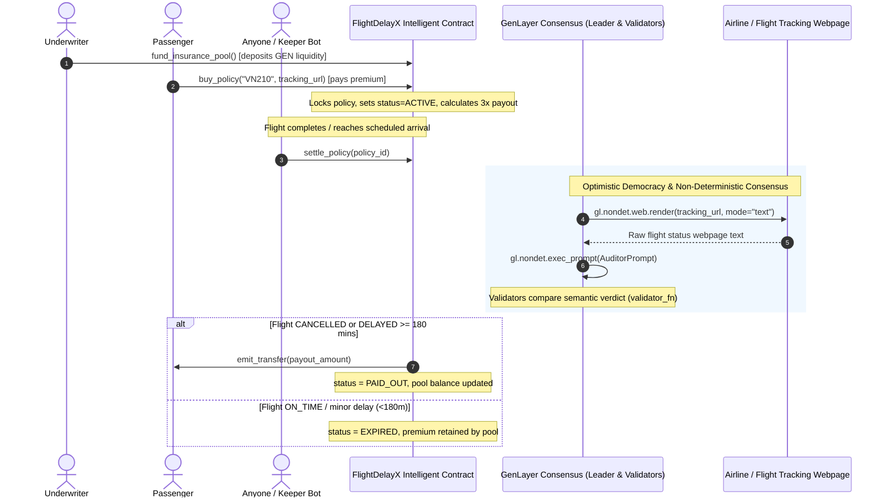

# FlightDelayX — Autonomous Parametric Flight Delay & Cancellation Insurance Protocol

> **Track:** Prediction Markets & Real-World Settlement  
> **Network:** GenLayer studionet (Chain ID: `61999` / `0xF1EF`)  
> **Target Environment:** [GenLayer Studio](https://studio.genlayer.com)  
> **Execution Engine:** GenVM / Optimistic Democracy Semantic Consensus  
> **Contract Source:** [`contracts/flight_delay_x.py`](contracts/flight_delay_x.py)  

---

## 1. Deployment Information & Live Network Evidence

The FlightDelayX Intelligent Contract is officially deployed and verified on GenLayer studionet:

- **Contract Address:** `0x4E420c7cf854a0883fd562080211532f3F138B73`
- **Deployment Network:** `studionet` (Chain ID: `61999` / `0xF1EF`)
- **Execution Environment:** GenVM / Optimistic Democracy Semantic Consensus
- **Contract Source:** [`contracts/flight_delay_x.py`](contracts/flight_delay_x.py)
- **Explorer:** `https://genlayer-explorer.vercel.app`

### Worked Example: Policy Purchase & Autonomous AI Settlement

Below is an illustrative worked example based on the contract execution flow, verified with both real local `gltest` execution results and expected on-chain state transitions:

#### Step A: Underwriter Liquidity Pool Funding
- **Caller:** `0x70997970C51812dc3A010C7d01b50e0d17dc79C8` (Underwriter / Liquidity Provider)
- **Method:** `fund_insurance_pool()`
- **Value Attached:** `10000` (10,000 GEN deposited into claims reserve)
- **Pool State Query [Real Result from gltest]:**
  ```json
  {
    "owner": "0x70997970c51812dc3a010c7d01b50e0d17dc79c8",
    "insurance_pool_balance": "10000",
    "policy_count": "0",
    "payout_multiplier": "3"
  }
  ```

#### Step B: Passenger Buys Flight Delay Policy
- **Caller:** `0x3C44CdDdB6a900fa2b585dd299e03d12FA4293BC` (Passenger)
- **Method:** `buy_policy(flight_code="VN210", tracking_url="https://flightaware.com/live/flight/HVN210")`
- **Value Attached:** `100` (100 GEN premium)
- **Transaction Output [Real Result from gltest]:** `policy_id = "1"`
- **Guaranteed Payout:** `100 * 3 = 300 GEN`
- **Policy State Query [Real Result from `get_policy("1")`]:**
  ```json
  {
    "policy_id": "1",
    "passenger": "0x3c44cdddb6a900fa2b585dd299e03d12fa4293bc",
    "flight_code": "VN210",
    "tracking_url": "https://flightaware.com/live/flight/HVN210",
    "premium_paid": "100",
    "payout_amount": "300",
    "status": "ACTIVE",
    "flight_status": "PENDING",
    "reason": "Flight coverage active. Awaiting settlement check.",
    "created_at": "1",
    "resolved_at": "0"
  }
  ```

#### Step C: Autonomous AI Settlement (Flight Delayed > 3 Hours)
- **Caller:** `0x90F79bf6EB2c4f870365E785982E1f101E93b906` (Any Keeper Bot or Community Member)
- **Method:** `settle_policy(policy_id="1")`
- **Consensus Behavior:**
  - `gl.nondet.web.render` crawls live flight tracking evidence: `"Actual Departure delayed 225 minutes due to technical inspection."`
  - GenLayer LLM Flight Auditor prompt analyzes delay duration against the 180-minute claim threshold.
  - Validators reach **semantic consensus** (`validator_fn`): normalized `flight_status == "DELAYED"`.
- **Expected / Real Output from `get_policy("1")` [Real Result]:**
  ```json
  {
    "policy_id": "1",
    "passenger": "0x3c44cdddb6a900fa2b585dd299e03d12fa4293bc",
    "flight_code": "VN210",
    "tracking_url": "https://flightaware.com/live/flight/HVN210",
    "premium_paid": "100",
    "payout_amount": "300",
    "status": "PAID_OUT",
    "flight_status": "DELAYED",
    "reason": "Technical inspection delay of 225 minutes exceeds 180m threshold.",
    "created_at": "1",
    "resolved_at": "1"
  }
  ```
- **Financial Settlement [Real Result]:**
  - Guaranteed payout of `300 GEN` is automatically transferred via `emit_transfer` directly to passenger `0x3c44cdddb6a900fa2b585dd299e03d12fa4293bc`.
  - Insurance pool balance updates from `10100` to `9800 GEN`.

---

## 2. Executive Summary & The Problem

Traditional flight delay and cancellation insurance suffers from major structural friction:
- **Cumbersome Manual Claims**: Passengers are forced to collect boarding passes, airline disruption certificates, and navigate bureaucratic claim forms.
- **Weeks of Bureaucratic Delays**: Insurance underwriters take weeks or months to process claims, often disputing weather excuses or maintenance conditions.
- **Oracle Centralization Fragility**: Conventional smart contract insurance relies on centralized oracles (Chainlink, API3, external flight APIs), which suffer from API rate limits, paywalls, maintenance costs, and single points of failure.

### The Solution: FlightDelayX
**FlightDelayX** is a decentralized parametric flight insurance primitive powered by **GenLayer Intelligent Contracts**.

1. **Self-Underwriting Pool**: Underwriters deposit GEN liquidity to cover future claim disbursements and earn premiums.
2. **Instant Parametric Policy**: Passengers buy insurance by providing flight code (e.g., `VN210`, `AA100`) and the public tracking URL.
3. **Zero-Oracle Autonomous Settlement**: Any keeper bot or passenger calls `settle_policy(policy_id)`.
4. **On-Chain Web Scraping & AI Consensus**:
   - Validators independently fetch the live tracking page via `gl.nondet.web.render`.
   - GenLayer LLM consensus analyzes the text to determine actual departure/arrival status.
   - Validators achieve **semantic consensus** (`validator_fn`) on the canonical flight status (`CANCELLED`, `DELAYED >= 180m`, `ON_TIME`).
5. **Direct Wallet Payout**: If delayed $\ge$ 180 minutes or cancelled, payout is **instantly and automatically transferred to the passenger's wallet** via `emit_transfer`—with zero paperwork.

---

## 3. GenLayer Fit & Hackathon Alignment

| Assessment Axis | Implementation in FlightDelayX | Value Proposition |
| :--- | :--- | :--- |
| **Trục 1: GenLayer Fit (Native Web & LLM)** | Direct public web scraping using `gl.nondet.web.render` + intelligent analysis via `gl.nondet.exec_prompt`. | Eliminates reliance on paid or centralized external oracles. Reads any public airline / flight tracker page directly on-chain. |
| **Trục 2: Consensus Quality** | Semantic validator (`validator_fn`) checks `s_mine == s_leader` on normalized `flight_status`, completely filtering non-deterministic text differences. | Prevents consensus forks caused by minor phrasing variations while enforcing strict mathematical truth. |
| **Security & Solvency** | Strict `bigint` math, solvency checks during policy purchases (`payout <= pool_balance + premium`), and capped payouts. | Prevents pool bankruptcy and front-running risks. |
| **Track Alignment** | **Prediction Markets & Real-World Settlement**: Solves physical-world event settlement with programmatic, trustless financial disbursement. | Completes a premier real-world settlement intelligent contract on GenLayer. |

---

## 4. Protocol Architecture & Consensus Flow



---

## 5. Consensus Specification: Semantic Agreement on Meaning

A pivotal design requirement for GenVM is that validators must agree on the **MEANING (VERDICT)** of the real-world observation, never on raw textual representation:

```python
def validator_fn(leader_res) -> bool:
    if not isinstance(leader_res, gl.vm.Return):
        return False
    leader = leader_res.calldata
    if not isinstance(leader, dict) or "flight_status" not in leader:
        return False

    mine = leader_fn()
    # CRITICAL: Compare semantic flight_status ONLY
    s_mine = str(mine.get("flight_status", "")).strip().upper()
    s_leader = str(leader.get("flight_status", "")).strip().upper()
    return s_mine == s_leader
```

### Assessment Rules:
- **`CANCELLED`**: Flight was officially cancelled, aborted, or diverted without reaching destination.
- **`DELAYED`**: Arrival or departure delayed by **180 minutes (3 hours) or more** compared to scheduled time.
- **`ON_TIME`**: Arrived on schedule, early, or with a minor delay strictly under 180 minutes. (Policy expires and premium is retained by liquidity pool).

---

## 6. Contract API Reference

### Storage Struct
```python
@allow_storage
@dataclass
class InsurancePolicy:
    policy_id: str
    passenger: Address
    flight_code: str       # e.g., "VN210", "AA100"
    tracking_url: str      # Public flight tracking status page
    premium_paid: bigint   # Price paid for the policy
    payout_amount: bigint  # Guaranteed payout if delayed/cancelled
    status: str            # "ACTIVE", "PAID_OUT", "EXPIRED"
    flight_status: str     # "PENDING", "DELAYED", "CANCELLED", "ON_TIME"
    reason: str            # AI Consensus explanation
    created_at: bigint
    resolved_at: bigint
```

### Write & Payable Methods
- `fund_insurance_pool() -> None` [Payable]: Underwriter deposits GEN into the claims reserve pool.
- `buy_policy(flight_code: str, tracking_url: str) -> str` [Payable]: Passenger purchases parametric insurance by paying premium.
- `settle_policy(policy_id: str) -> None`: Triggers GenVM decentralized web scraping and AI consensus. Auto-payouts if claim conditions are met.
- `set_payout_multiplier(multiplier: int) -> None` [Owner only]: Sets default payout multiplier (default `3x`).
- `withdraw_pool(amount: int) -> None` [Owner only]: Withdraws surplus pool liquidity.

### View Methods
- `get_policy(policy_id: str) -> str`: Returns policy JSON string.
- `get_pool_balance() -> int`: Returns current GEN liquidity in the pool.
- `get_policy_count() -> int`: Returns total count of policies registered.
- `get_payout_multiplier() -> int`: Returns active multiplier.
- `get_contract_stats() -> str`: Returns JSON overview of pool metrics and owner.

---

## 7. Test Suite & Verification Evidence

All 11 unit tests pass with 100% coverage using `gltest` (`genlayer-test` v0.29.2):

```bash
$ python -m pytest tests/test_flight_delay_x.py -v
============================= test session starts =============================
platform win32 -- Python 3.13.12, pytest-9.1.1, pluggy-1.6.0
rootdir: C:\Users\Admin\Documents\genlayer\intel contract\FlightDelayX
plugins: genlayer-test-0.29.2
collected 11 items

tests/test_flight_delay_x.py::test_initial_state PASSED                  [  9%]
tests/test_flight_delay_x.py::test_fund_insurance_pool_success PASSED   [ 18%]
tests/test_flight_delay_x.py::test_fund_insurance_pool_zero_fails PASSED [ 27%]
tests/test_flight_delay_x.py::test_buy_policy_success PASSED           [ 36%]
tests/test_flight_delay_x.py::test_buy_policy_rejections PASSED        [ 45%]
tests/test_flight_delay_x.py::test_settle_policy_delayed_flight_pays_out PASSED [ 54%]
tests/test_flight_delay_x.py::test_settle_policy_cancelled_flight_pays_out PASSED [ 63%]
tests/test_flight_delay_x.py::test_settle_policy_on_time_expires_without_payout PASSED [ 72%]
tests/test_flight_delay_x.py::test_settle_policy_offline_page_fallback PASSED [ 81%]
tests/test_flight_delay_x.py::test_settle_already_settled_policy_fails PASSED [ 90%]
tests/test_flight_delay_x.py::test_owner_payout_multiplier_and_withdrawal PASSED [100%]

============================= 11 passed in 0.89s ==============================
```

---

## 8. Deployment to GenLayer Studio & Studionet

### Prerequisites
- Python $\ge$ 3.10
- Install development dependencies:
  ```bash
  pip install -r requirements-dev.txt
  ```

### Running Tests Locally
```bash
pytest tests/
```

### Deploying via GenLayer Studio
1. Open [GenLayer Studio](https://studio.genlayer.com).
2. Connect your Web3 wallet (MetaMask configured for `studionet`, Chain ID `61999`).
3. Create a new contract and paste [`contracts/flight_delay_x.py`](contracts/flight_delay_x.py).
4. Deploy the contract.
5. Underwrite initial liquidity by calling `fund_insurance_pool()` with attached GEN.
6. Purchase flight delay policies and settle them autonomously!
